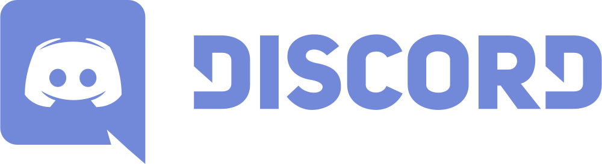

# My Personal Discord Bot 

## About this project
### Overview
This Discord bot is being developed to enhance server interactivity and streamline community management. Designed with modular features and scalability in mind, it aims to provide utility, entertainment, and robust moderation tools for both casual and professional environments.

### Core Objectives
1. Facilitate Engagement: Introduce interactive commands to foster active participation.
2. Streamline Moderation: Automate repetitive admin tasks like role assignments, warnings, and content filtering.
3. Scalable Architecture: Allow easy expansion and customization for multiple servers.

### Technical Stack
- Languages & Libraries: Python, discord.py
-  APIs: Discord API, and others (final selection has not been made)

### Development Focus
- User-centric design with clear documentation
- Performance optimization and error-handling
- Secure command execution and data management

## Status
Currently in active development and being tested within a dedicated "third space" server. Feature requests and feedback are gathered in real-time to refine functionality.

### Milestones
- Get the Discord Bot online ✅
- Add functionality
  - Access MTG API to get real time data on cards
  - Notify users about new posts on my tech IG account
  - Assist with rule enforcement
  - Automate wehcloming new members ✅
  - Grant users roles
  - Organize users' request via ticketing system
- Host the bot on multiple discord servers

## Quick Facts about my bot
- The bot pulls its configuration settings from an external JSON file, making it easy to support multiple servers. Whenever a new member joins, the bot sends a personalized welcome message that's tailored to each server—fully customizable depending on the vibe you're going for.

